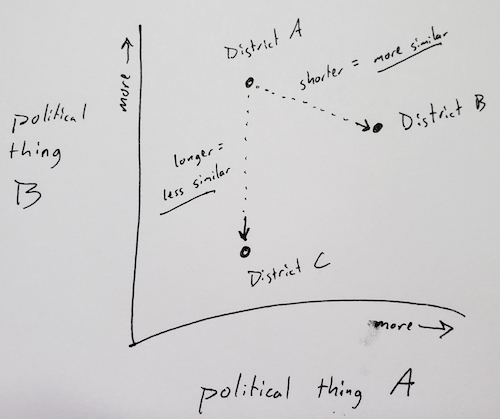

# 2018 district similarity maps

This repo contains the code we're using at POLITICO this year to create comparisons between congressional districts.

The output is a series of maps (really just lists) that relate any one district to the districts most like it by some measures.

We create two sets of maps, one based strictly on political voting history and a second based on demographics weighted by their influence on two-party vote outcomes.


### Notebooks

##### [Political similarity maps](political_similarity.ipynb)

##### [Demographic similarity maps](demographic_similarity.ipynb)

### Running the notebooks

You'll need an `.env` file defined in the root of this project, defined with the following variables:

```
CENSUS_API_KEY=
AWS_ACCESS_KEY_ID=
AWS_SECRET_ACCESS_KEY=
AWS_S3_BUCKET=
```

Then you can run the notebooks using pipenv:

```
$ pipenv install
$ pipenv run jupyter notebook
```

### The model

See the notebooks for more detailed descriptions and a few caveats, but the basic steps are:

1. Pick our variables, political or demographic
2. Weight them according to their significance and/or recency
3. Plot them in (n-dimensional) Euclidean space
4. Measure the distance between each plotted district and all others

Simplified to just two dimensions, it's this:



The code will also output some CSVs that are useful for evaluating the model.
